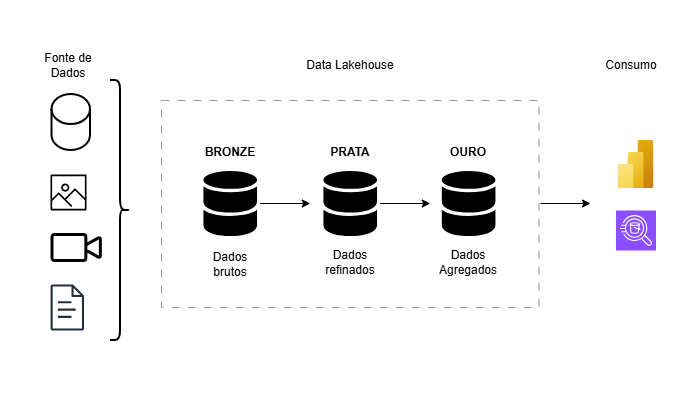

# Arquitetura do Data Lakehouse
O objetivo desta arquitetura é centralizar dados operacionais (SQL), semiestruturados (NoSQL) e históricos em um único repositório analítico.

## Estrutura de Camadas (Medalhão)
1.  **Raw Zone (Bronze)**: Armazena os dados brutos conforme extraídos das fontes originais (ex: dump do MongoDB, logs do Cassandra).
2.  **Cleansed Zone (Prata)**: Dados processados, sem duplicidade e padronizados (ex: padronização de datas e limpeza de strings).
3.  **Business Zone (Ouro)**: Tabelas agregadas e otimizadas para consumo final em ferramentas de BI como Power BI.

## Tecnologias Sugeridas
* **Armazenamento**: Amazon S3 ou Azure Data Lake Storage.
* **Processamento**: Apache Spark ou Databricks para as transformações entre camadas.
* **Consulta**: Amazon Athena ou Google BigQuery para análises rápidas via SQL.

## Diagrama Data Lakehouse

